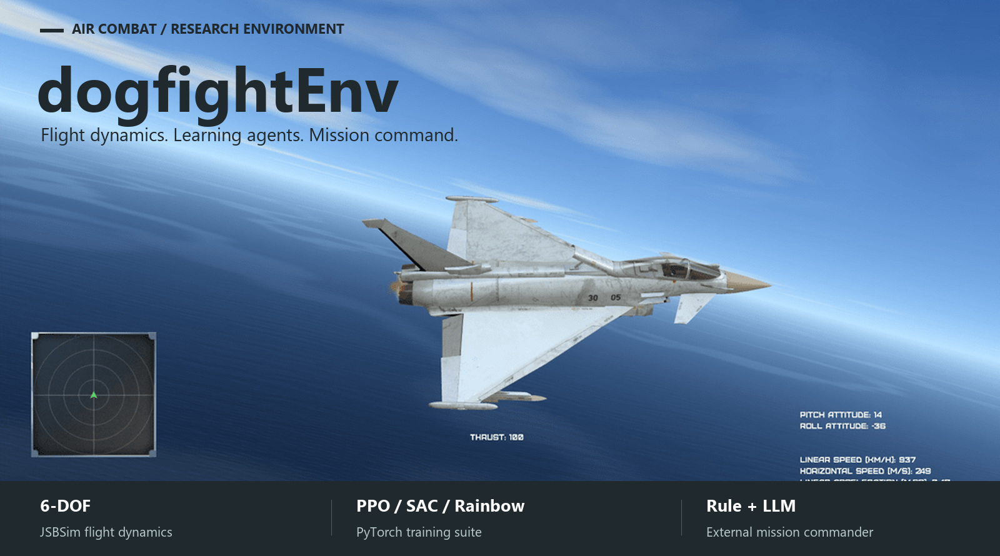
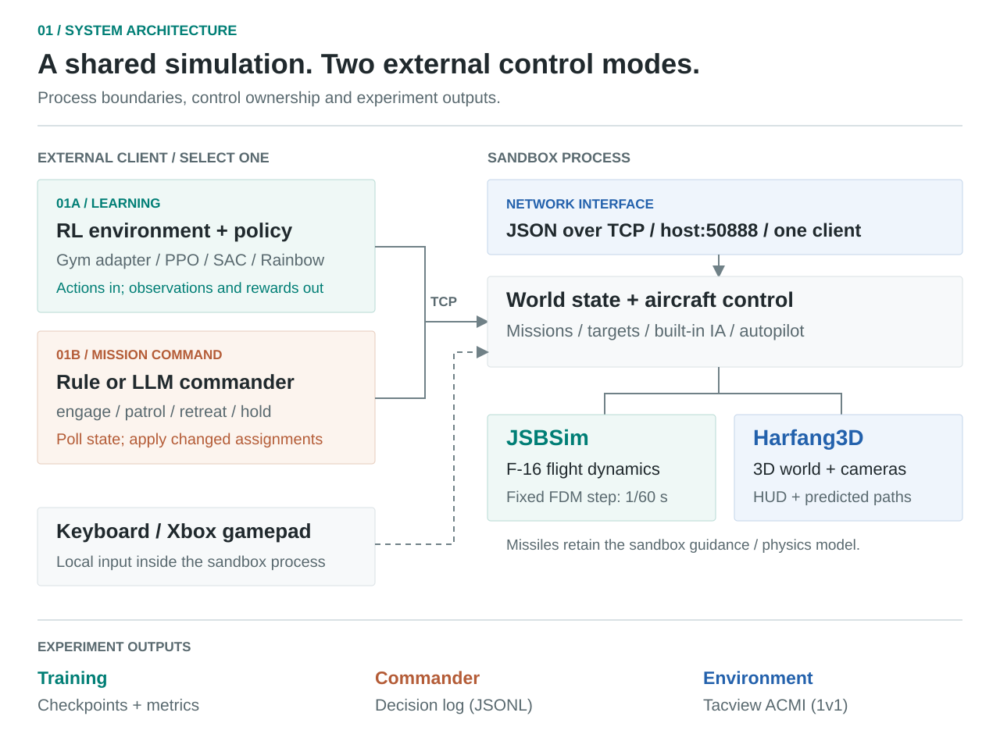
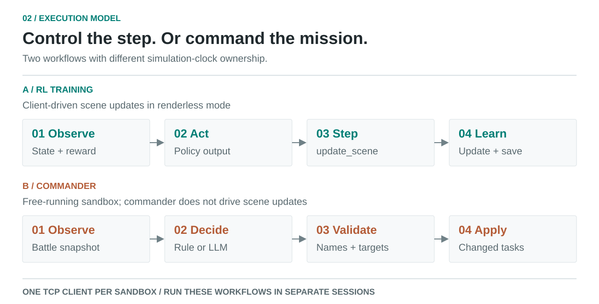
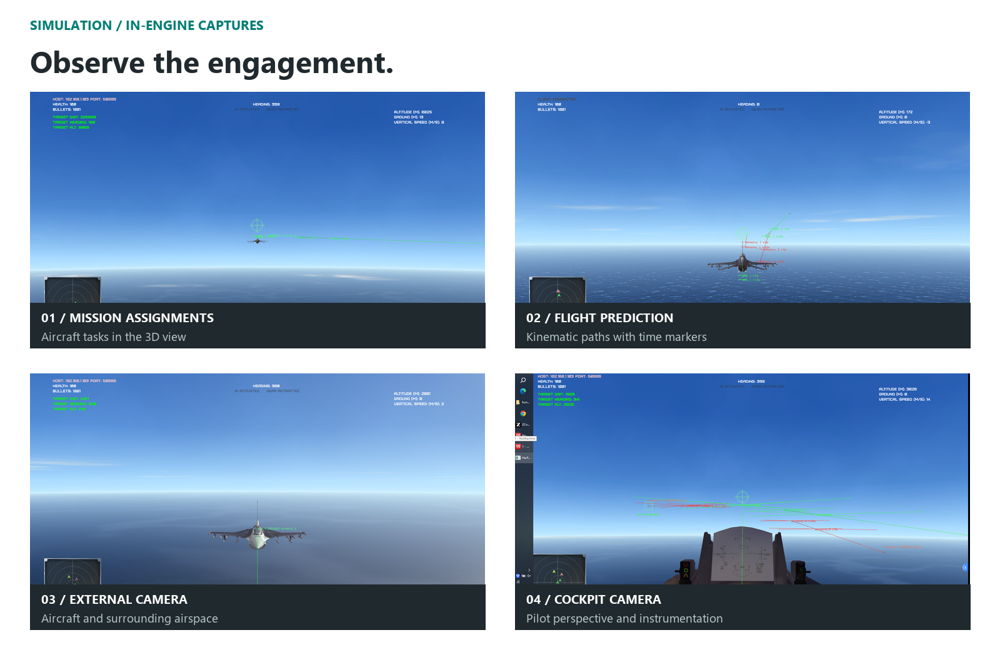

# dogfightEnv

> An air-combat research environment that combines JSBSim six-DOF flight dynamics, Harfang3D visualization, Gym-style interfaces, and a pluggable mission commander.

<div align="center">



**Flight dynamics · Learning agents · Mission command**

[简体中文](README.md) · [Network protocol](dogfight_sandbox_hg2/documentation_network.md) · [Issues](https://github.com/SergioTermann/dogfightEnv/issues)

</div>

## What this is

dogfightEnv turns a visual air-combat sandbox into a programmable experiment platform. The sandbox owns the world state, aircraft, missiles, and rendering. An external client owns learning or mission decisions. Both sides communicate through one JSON-over-TCP protocol.

Use it to train air-combat policies, study flight control and missile evasion, assign tactical tasks with rules or an OpenAI-compatible model, fly with a keyboard / Xbox gamepad, and replay experiments through 3D views, JSONL logs, and Tacview ACMI.

## Capability map

| Area | Capability | Engineering detail |
|---|---|---|
| Flight dynamics | JSBSim 1.2.1 | F-16 aerodynamics, F100-PW-229 engine, afterburner, SAS flight control; fixed 1/60 s FDM step |
| Simulation | Harfang3D | Ocean / terrain / clouds, HUD, camera suite, and live trajectory prediction |
| RL environments | Gym-style API | `oneVSone`, `twoVSone`, `ia_enemy`; reference environment exposes 25 observations / 5 actions |
| Training | Native PyTorch suite | PPO, SAC, Rainbow with normalization, checkpoints, logs, and evaluation entry points |
| Mission command | External Commander | Rule engine or OpenAI-compatible LLM; `engage / patrol / retreat / hold` |
| Network | JSON over TCP | Default `host:50888`; one sandbox process accepts one TCP client at a time |

## System architecture



RL and Commander are separate external control modes. Keyboard and gamepad input stay inside the sandbox process and do not consume the TCP client slot. Run training and command sessions separately.

## Execution model



In renderless RL mode, the environment advances the simulation through `update_scene`. Commander only polls state and applies changed assignments while the sandbox runs freely.

## Quick start

### Requirements

| Item | Requirement |
|---|---|
| OS | Windows 10 / 11 |
| Sandbox runtime | Bundled embedded Python 3.8, Harfang, JSBSim, and numpy |
| RL / Commander | System Python 3.8+; training additionally requires `torch>=2.0` |
| GPU | Optional; CUDA can accelerate training |
| Assets | `source/assets/` and `assets_compiled/` are not tracked in Git and must be provisioned separately |

### 1. Start the sandbox

```powershell
cd dogfight_sandbox_hg2/source
..\bin\python\python.exe main.py auto_network mission=1
```

`mission=1 / 2 / 3` selects the 1v1 / 2v2 / 3v3 network mission. The actual `HOST / PORT` is shown in the upper-left corner; the default port is `50888`.

### 2. Connect a Gym environment

```python
from oneVSoneEnv import oneVSoneEnv

env = oneVSoneEnv(host="192.168.1.103", port="50888", rendering=True)
obs = env.reset()
action = env.action_space.sample()  # [roll, pitch, yaw, thrust, fire]
obs, reward, done, info = env.step(action)
```

Environment implementations live at the repository root: `oneVSoneEnv.py`, `twoVStwo.py`, `IA_enemy_env.py`, `dogfightEnv.py`, and `human_expert_env.py`.

### 3. Start the mission commander

```powershell
cd llm_commander
..\dogfight_sandbox_hg2\bin\python\python.exe commander.py
```

The default rule engine has no external dependency. Useful flags:

```powershell
python commander.py --dry-run       # print decisions without applying commands
python commander.py --once           # run one decision cycle
python commander.py --duration 60    # stop after 60 seconds
```

Set `engine` to `llm` in `llm_commander/config.json` and provide `llm.api_key` to enable an LLM. `api_base` accepts an OpenAI-compatible chat completions endpoint. Failed calls keep the previous plan. Decisions are written to `llm_commander/decisions.jsonl`.

## RL training suite

```powershell
pip install -r requirements-train.txt
python -m training.train --algo ppo --env oneVSone --timesteps 500000
python -m training.train --algo sac --env oneVSone --timesteps 1000000
python -m training.train --algo rainbow --env oneVSone --timesteps 1000000
python -m training.enjoy --model checkpoints/ppo_oneVSone/model_best.pt --episodes 3
```

Artifacts are stored in `checkpoints/<algo>_<env>/`: `model_best.pt`, `model_final.pt`, normalization state, and `log.jsonl`. Override hyperparameters with `--set key=value`; select a device with `--device cpu/cuda`.

| Algorithm | Action space | Implementation notes |
|---|---|---|
| PPO | Continuous Box | GAE, clipped objective, Gaussian policy |
| SAC | Continuous Box | Twin Q, automatic temperature, soft updates |
| Rainbow | Discrete grid | n-step, Double Q, Dueling, NoisyNet, PER, C51 |

## Physics and prediction

- All current aircraft types map to the JSBSim F-16 data; see `dogfight_sandbox_hg2/source/jsbsim_flight_model.py`.
- `dogfight_sandbox_hg2/config.json` switches between the `jsbsim` and `legacy` physics engines.
- Trajectory prediction extrapolates the next 10 seconds by default; configure `FlightPrediction.enabled / horizon_s / steps`.
- Missiles retain the sandbox proportional-navigation model; `get_plane_state` adds a `physics_engine` field.

## Simulation gallery



## Controls and views

Keyboard: `Up Down Left Right` for pitch / roll, `Home / End` throttle, `Space` afterburner, `Enter` gun, `F1` missile, `T` target, `G` gear, `B / N` airbrake, `C / V` flaps, `I` IA, `A` autopilot, `E` easy steering.

Numpad views: `2 / 8 / 4 / 6` rear / front / left / right, `5` satellite, `3` cockpit, `1` next tracked aircraft, `Insert / PageUp` field of view. Full gamepad bindings are in [gamepad_mapping_en.svg](docs/images/gamepad_mapping_en.svg).

## Tests

```powershell
cd dogfight_sandbox_hg2
bin\python\python.exe tools/test_jsbsim_physics.py
bin\python\python.exe tools/test_llm_commander.py
python tools/test_training_smoke.py
```

For a sandbox-free check of the algorithms, run `python -m training.tests.test_algos_toy`.

## Engineering boundaries

- One sandbox process accepts one TCP client, so Commander and an RL environment cannot share one instance.
- Aircraft currently share the F-16 aerodynamic model; additional JSBSim aircraft data is pending.
- Large models and textures are excluded from Git; use Git LFS or a separate asset package.

## Roadmap

- [ ] Ship a complete asset package through Git LFS
- [ ] Support concurrent Commander and RL clients
- [ ] Add JSBSim aerodynamic data for more aircraft types
- [ ] Add standardized evaluation missions and reproducible experiment configs

## License and acknowledgements

`dogfight_sandbox_hg2/` is derived from [harfang3d/dogfight-sandbox-hg2](https://github.com/harfang3d/dogfight-sandbox-hg2) and is licensed under GPL-3.0. Thanks to Harfang Technologies and [mrwangyou/DBRL](https://github.com/mrwangyou/DBRL).

Built with [Harfang3D](https://harfang3d.com/), [JSBSim](https://github.com/JSBSim-Team/jsbsim), and [PyTorch](https://pytorch.org/).
