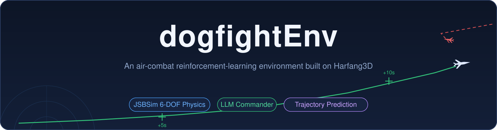

<a id="top"></a>

<div align="center">



<br/>

[](https://github.com/SergioTermann/dogfightEnv/stargazers)
[](https://github.com/SergioTermann/dogfightEnv/network/members)
[](https://github.com/SergioTermann/dogfightEnv/issues)
[](dogfight_sandbox_hg2/LICENSE)
[](#-quick-start)
[](#-rl-training-suite)
[](#-quick-start)

<br/>

<a href="#-quick-start"></a>
<a href="https://github.com/SergioTermann/dogfightEnv/blob/main/dogfight_sandbox_hg2/documentation_network.md"></a>
<a href="#-rl-training-suite"></a>
<a href="https://github.com/SergioTermann/dogfightEnv/issues/new"></a>

**English | [简体中文](README.md)**

✨ [Key Features](#-key-features) · 🏗️ [Architecture](#-architecture) · 🚀 [Quick Start](#-quick-start) · 🛩️ [JSBSim Physics](#-jsbsim-6-dof-flight-dynamics) · 🔮 [Prediction](#-trajectory-prediction) · 🎖️ [LLM Commander](#-llm-mission-commander) · 🎓 [RL Training](#-rl-training-suite) · 🕹️ [Controls](#-controls) · 📷 [Views](#-camera-views) · 🧪 [Tests](#-tests) · 🗺️ [Roadmap](#-roadmap) · 📄 [License](#-license)

</div>

---

## ✨ Key Features

| | Feature | Description |
|:---:|---|---|
| 🛩️ | **JSBSim 6-DOF physics** | F-16A aerodynamics + F100-PW-229 engine (with afterburner), realistic stall / lift-drag behavior; fixed 1/60 step, fully deterministic for RL |
| 🎖️ | **LLM mission commander** | An external commander process watches the whole battle and assigns `engage / patrol / retreat` tasks per aircraft; rule ↔ LLM engine switch in one config line |
| 📈 | **Trajectory prediction** | Each aircraft's next 10 seconds of flight drawn live in the 3D view (green = friendly / red = hostile, +5s / +10s cross markers) |
| 🌐 | **Unified TCP/IP protocol** | RL clients, the commander and human players all speak the same JSON protocol on `IP:50888`; rendered and headless modes ([full API docs](https://github.com/SergioTermann/dogfightEnv/blob/main/dogfight_sandbox_hg2/documentation_network.md)) |
| 🎮 | **Humans in the loop** | Fly directly with keyboard / Xbox-layout gamepad, switch between eight camera views, and record expert demonstrations for RL |
| 🧪 | **Tested** | 14 physics regression checks + 12 commander end-to-end checks + 10 training smoke checks |

## 🏗️ Architecture

Every controller (RL client / LLM commander / human player) plugs into the sandbox through the same TCP/IP channel:


## 🚀 Quick Start

| Item | Requirement |
|---|---|
| OS | Windows 10 / 11 |
| Sandbox runtime | Bundled embedded Python 3.8 (`bin/python/`, jsbsim + numpy included) — zero install |
| RL envs (system Python) | `gym` · `numpy` · `harfang` · `prettytable` |
| Training suite | `torch ≥ 2.0`: `pip install -r requirements-train.txt` |
| GPU | Optional, CUDA speeds up training |

**1️⃣ Start the sandbox**

```bash
cd dogfight_sandbox_hg2/source
../bin/python/python.exe main.py auto_network mission=1
```

- `mission=1 / 2 / 3` selects the 1v1 / 2v2 / 3v3 network mission (default 1v1); or run `dogfight_sandbox_hg2\start.bat` and pick from the menu
- Ready when the window titled `Harfang` appears; the server listens on port `50888` at the machine's LAN IP (shown as `HOST / PORT` in the window's top-left corner)

**2️⃣ Connect a Gym-style RL environment**

```python
from oneVSoneEnv import oneVSoneEnv   # or twoVStwo / IA_enemy_env ...

env = oneVSoneEnv(host='192.168.1.103', port='50888', rendering=True)   # replace host with your LAN IP
obs = env.reset()
action = env.action_space.sample()    # [roll, pitch, yaw, thrust, fire]
obs, reward, done, info = env.step(action)
```

**3️⃣ Start the LLM mission commander** (second terminal)

```bash
cd llm_commander
../dogfight_sandbox_hg2/bin/python/python.exe commander.py
```

The commander immediately takes over every aircraft of the configured side (default: red `ennemies`): assigns attack targets, disengages badly damaged planes, patrols when no targets remain — each aircraft's current task floats above it in the 3D view:

| Commander task assignment (live 2v2) | Trajectory prediction |
|:---:|:---:|
|  |  |
| ▲ Green `ALLY_1 ENGAGE ennemy_1` and red `ENNEMY_1 ENGAGE ALLY_1` labels in the same frame | ▲ Green predicted path and `+5s` cross marker ahead of the player's jet |

Useful flags: `--dry-run` (print decisions only), `--once` (single decision cycle), `--duration N` (stop after N seconds).

> 💡 To train / watch an agent, see the [RL Training Suite](#-rl-training-suite).

## 🛩️ JSBSim 6-DOF Flight Dynamics

Aircraft dynamics were replaced from the sandbox's original simplified model with **JSBSim 1.2.1**:

- Every aircraft type uses the F-16 model (no open JSBSim data exists for the others; see the mapping table in `dogfight_sandbox_hg2/source/jsbsim_flight_model.py`)
- Realistic SAS: neutral stick = attitude hold; yaw input couples into roll (coordinated turns); alpha / flight-path envelope protection against stalls; predictive Auto-GCAS; automatic wings-leveling on stick release
- Missiles keep the original proportional-navigation physics
- Network protocol and action/observation spaces are fully backward compatible; `get_plane_state` adds a `physics_engine` field
- Fixed 1/60 FDM step; in renderless client-driven mode each `update_scene` advances exactly one step
- Engine switch: `dogfight_sandbox_hg2/config.json` → `"Physics": {"engine": "jsbsim"}` (set `"legacy"` to fall back)

## 🔮 Trajectory Prediction

The 3D view draws each JSBSim aircraft's **next 10 seconds of predicted path** in real time: a kinematic extrapolation of the current turn rate / pitch rate / acceleration with exponential decay — green for friendlies, red for hostiles, a cross marker + `+Ns` label every 5 seconds (distance-scaled so far markers stay readable).

Config: `config.json` → `"FlightPrediction": {"enabled": true, "horizon_s": 10, "steps": 20}`

## 🎖️ LLM Mission Commander

`llm_commander/` is an external "air commander" process that talks to the sandbox only over IP:50888 and **never drives the simulation clock** — the sandbox free-runs at 60 fps, so decision latency (instant for rules, seconds for an LLM) cannot stall the battle.

**Task vocabulary** (all mapped onto existing protocol primitives):

| Task | Execution |
|---|---|
| `engage(target)` | `SET_TARGET_ID` → `ACTIVATE_IA` (target set before activation to avoid random IA targeting) |
| `patrol(heading/alt/speed)` | IA off + autopilot cruise |
| `retreat` | High-speed egress on a heading away from the nearest threat (800 m / 260 m/s) |
| `hold` | Keep current state |

**Pluggable decision engine** (`engine` field in `llm_commander/config.json`):

```jsonc
{
  "side": "ennemies",        // which side to command: ennemies / allies
  "engine": "rule",          // "rule" = built-in tactician (default, no API key)
                             // "llm"  = any OpenAI-compatible model
  "decision_period_s": 10,   // decision period; losses trigger an immediate re-plan
  "blue_ia": false,          // sparring: built-in IA on the opposite side (when commanding red)
  "red_ia": false,           // same, when commanding blue
  "llm": {
    "api_base": "https://open.bigmodel.cn/api/paas/v4/chat/completions",
    "api_key": "",           // fill in a key to enable LLM decisions
    "model": "glm-4-flash"
  }
}
```

- **Rule engine**: nearest-enemy 1v1 pairing with conflict spreading, retreat when health < 0.35 or out of missiles, focused fire when outnumbered, patrol back to center when no targets remain
- **LLM engine**: an "air commander" system prompt + battle-state JSON (grid-km positions / health / missiles / distance matrix) → strict JSON output; hallucinated plane names and invalid targets are dropped, the previous plan is kept on API failure; defaults to Zhipu GLM — switch to OpenAI / DeepSeek / local vLLM by changing `api_base`
- Decisions are logged to `llm_commander/decisions.jsonl`; commands are sent only when a task actually changes

## 🎓 RL Training Suite

`training/` provides a self-contained modular algorithm suite (pure PyTorch, zero new dependencies) with a unified entry point:

| Algorithm | Type | Action space | Key components |
|---|---|:---:|---|
| `ppo` | on-policy | continuous Box | GAE, clipped objective, Gaussian policy |
| `sac` | off-policy | continuous Box | twin Q, auto temperature, soft updates |
| `rainbow` | off-policy | discrete grid (54 by default) | n-step, double-Q, dueling, NoisyNet, PER, C51 |

```bash
# 1. start the sandbox (1v1)
cd dogfight_sandbox_hg2/source && ../bin/python/python.exe main.py auto_network

# 2. train (second terminal, system Python)
python -m training.train --algo ppo --env oneVSone --timesteps 500000
python -m training.enjoy --model checkpoints/ppo_oneVSone/model_best.pt   # watch a checkpoint
```

<details>
<summary>⚙️ More options and notes</summary>

```bash
python -m training.train --algo sac     --env oneVSone --timesteps 1000000
python -m training.train --algo rainbow --env oneVSone --timesteps 1000000
```

- Override any hyperparameter with `--set key=value` (e.g. `--set lr=1e-4 gamma=0.995`); `--device cpu/cuda`, `--render`, `--seed`, `--no-normalize` available
- The adapter layer handles the legacy gym API, running observation normalization (stats saved with checkpoints) and the stale-reset fix; Rainbow discretizes actions through a configurable grid (`training/wrapper.py`)
- Logs go to `checkpoints/<algo>_<env>/log.jsonl` (episode return/length/losses); best model saved as `model_best.pt`
- One sandbox serves one TCP client: a single training process at a time
- Sandbox-free self-test: `python -m training.tests.test_algos_toy` (convergence + roundtrip on a mock env)

</details>

**Built-in Gym environments**:

| File | Scenario | Notes |
|---|---|---|
| `oneVSoneEnv.py` | 1v1 | Reference implementation: 25-dim obs / 5-dim action (sticks·throttle·fire), Tacview ACMI logging |
| `twoVStwo.py` | 2v2 | Two-ship coordinated actions |
| `IA_enemy_env.py` | 1v1 vs IA | Enemy flown by the built-in IA |
| `dogfightEnv.py` | Missile evasion | Dodge an incoming missile |
| `human_expert_env.py` / `controller_env.py` | Data collection | Human-expert demonstration capture |

## 🕹️ Controls

**Keyboard**: `↑↓←→` pitch/roll · `Home/End` throttle ± · `Space` afterburner · `Enter` machine gun · `F1` missile · `F5` rearm · `T` next target · `G` gear · `B/N` airbrake · `C/V` flaps · `I` hand to IA · `A` autopilot · `E` easy steering

<details>
<summary>🎮 Xbox gamepad mapping (click to expand)</summary>

Plug in an Xbox-layout gamepad and fly (bindings: `dogfight_sandbox_hg2/source/scripts/aircraft_user_inputs_mapping.json` → `"GamePad"`):


</details>

## 📷 Camera Views

Switch views instantly on the numpad: `2/8/4/6` rear/front/left/right chase · `5` satellite · `3` cockpit · `1` cycle tracked aircraft · `Insert/PageUp` zoom.

<details>
<summary>🖼️ Six-view gallery (click to expand)</summary>

| Rear chase (default `2`) | Front head-on (`8`) |
|:---:|:---:|
|  |  |
| **Left chase (`4`)** | **Right chase (`6`)** |
|  |  |
| **Satellite top-down (`5`)** | **Cockpit (`3`)** |
|  |  |

</details>

## 🧪 Tests

```bash
# JSBSim physics calibration regression (14 checks: sign conventions / trim / reset / 30 s neutral stability)
cd dogfight_sandbox_hg2 && bin/python/python.exe tools/test_jsbsim_physics.py

# Commander end-to-end (12 checks: boots a 2v2 sandbox, verifies observe -> decide -> apply)
cd dogfight_sandbox_hg2 && bin/python/python.exe tools/test_llm_commander.py

# Training suite smoke test on the real sandbox (10 checks)
python dogfight_sandbox_hg2/tools/test_training_smoke.py
```

## ⚠️ Known Limitations

- The sandbox accepts a **single** TCP client at a time: the commander and an RL environment cannot be connected simultaneously
- Every aircraft type uses the F-16 aerodynamic model (no open JSBSim data for the others yet)
- `dogfight_sandbox_hg2/source/assets/` and `assets_compiled/` (~1.6 GB of models/textures) are not tracked; distribute them out-of-band or via [Git LFS](https://git-lfs.com/)

## 🗺️ Roadmap

- [ ] Ship sandbox assets via Git LFS so clones are complete out of the box
- [ ] Multiple simultaneous clients (commander + RL environment online together)
- [ ] JSBSim aerodynamic data for more aircraft types

Ideas? [Open an issue](https://github.com/SergioTermann/dogfightEnv/issues/new).

## 🤝 Contributing

Issues and PRs are welcome! Flow: fork → branch → make your change, keep the [tests](#-tests) green → open a PR.

<a href="https://github.com/SergioTermann/dogfightEnv/issues/new"></a>
<a href="https://github.com/SergioTermann/dogfightEnv/issues/new"></a>
<a href="https://github.com/SergioTermann/dogfightEnv/compare"></a>
<a href="https://github.com/SergioTermann/dogfightEnv/fork"></a>

## 🙏 Acknowledgments

- **[harfang3d/dogfight-sandbox-hg2](https://github.com/harfang3d/dogfight-sandbox-hg2)** — the foundation of this project. The sandbox's Harfang3D rendering and simulation framework, aircraft/missile/ship models, the island-chain sea scene and the TCP/IP network protocol all come from that upstream project; the JSBSim 6-DOF physics replacement, flight-control SAS, trajectory prediction and LLM mission commander are extensions layered on top of it. Thanks to Harfang Technologies for open-sourcing it.
- **[mrwangyou/DBRL](https://github.com/mrwangyou/DBRL)** — thanks for the great support to this project.

## 📄 License

The bundled [dogfight_sandbox_hg2](dogfight_sandbox_hg2/) sandbox originates from [harfang3d/dogfight-sandbox-hg2](https://github.com/harfang3d/dogfight-sandbox-hg2) and is licensed under **GPL-3.0** (see [dogfight_sandbox_hg2/LICENSE](dogfight_sandbox_hg2/LICENSE)); modifications and extensions to the sandbox are likewise provided under GPL-3.0.

---

<div align="center">

**If this project helps you, please consider giving it a ⭐**

<a href="https://github.com/SergioTermann/dogfightEnv"></a>

<br/>

Powered by [Harfang3D](https://harfang3d.com/) · [JSBSim](https://github.com/JSBSim-Team/jsbsim) · [PyTorch](https://pytorch.org/)


[⬆ Back to top](#top)

</div>
