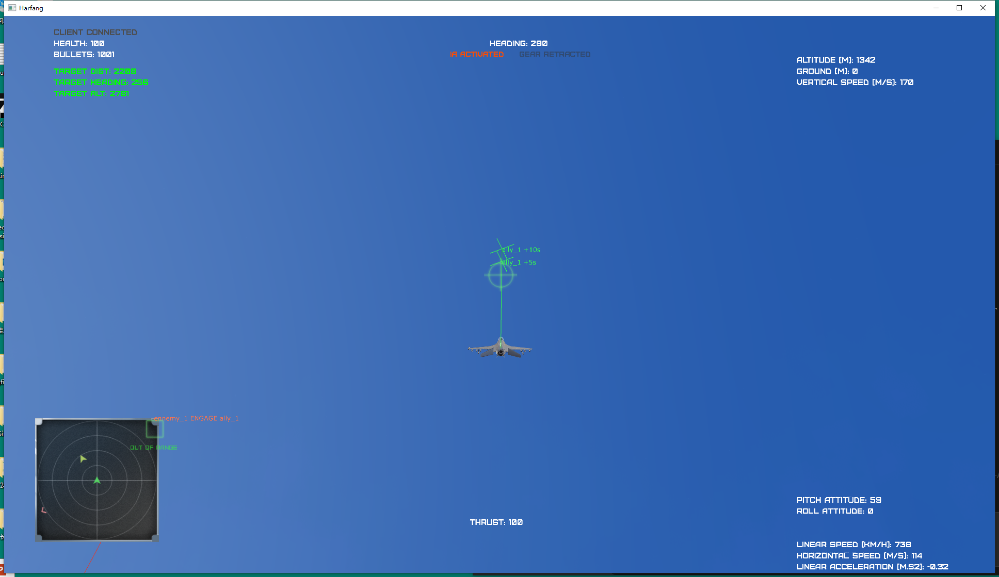
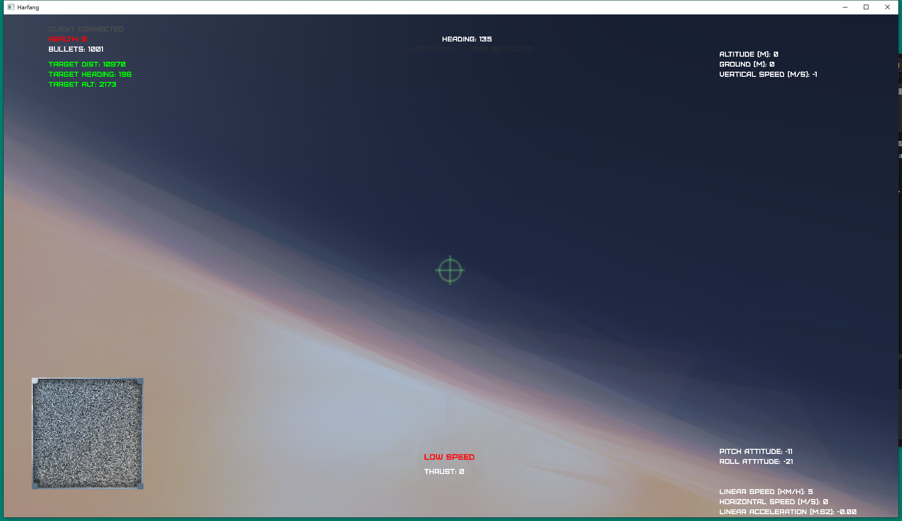
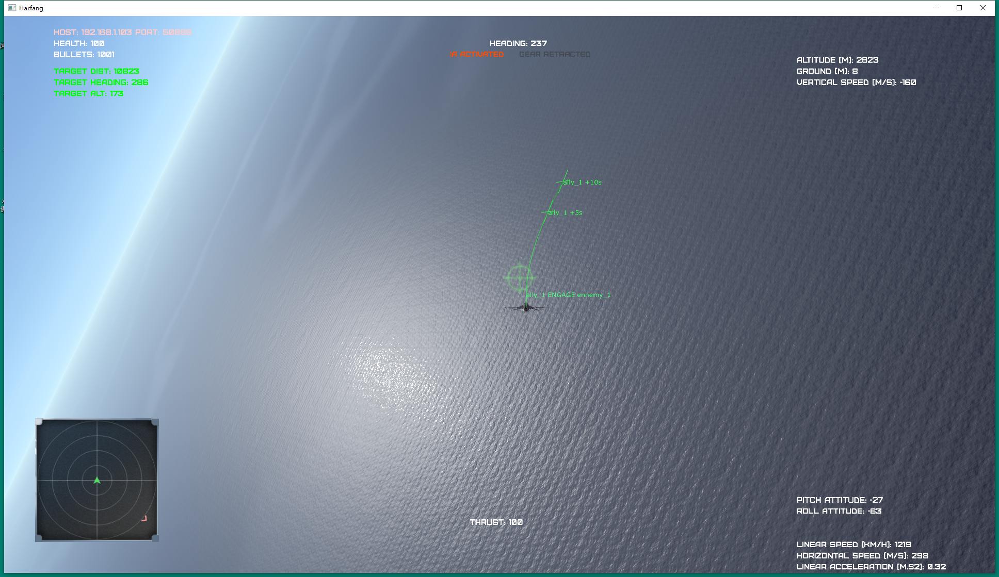
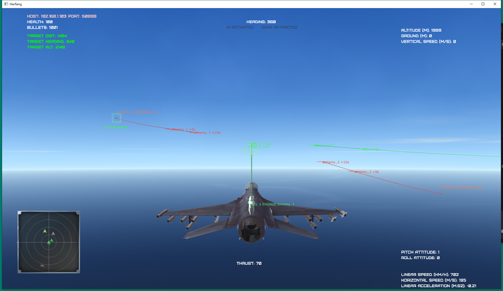
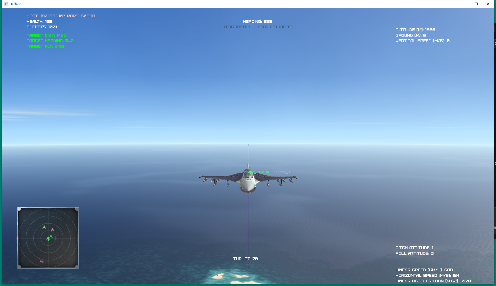
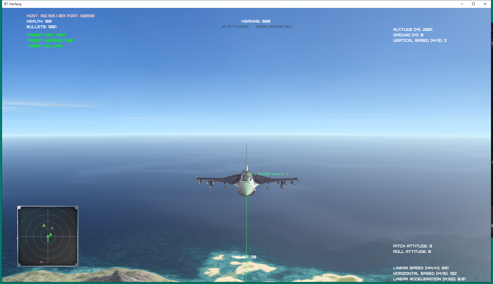
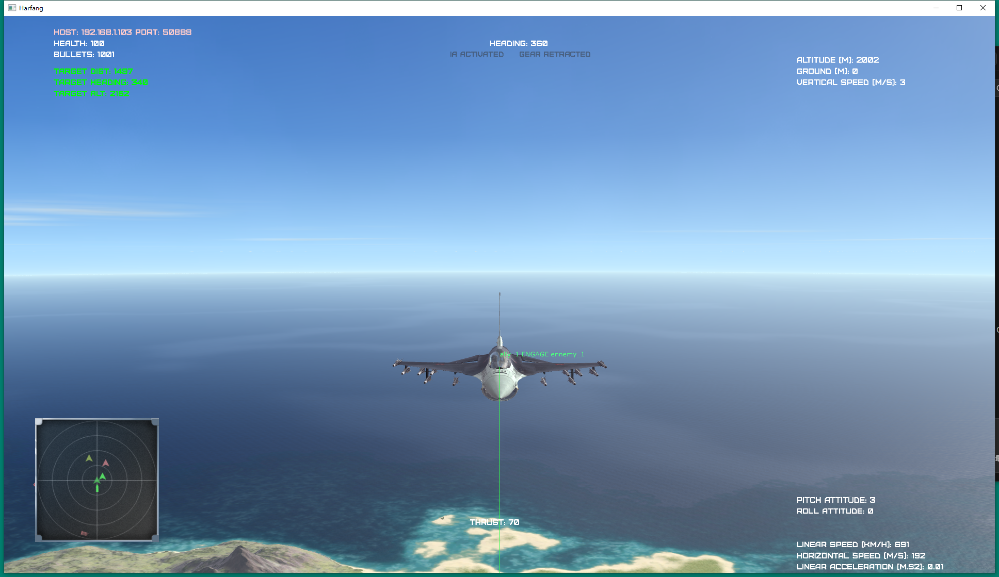
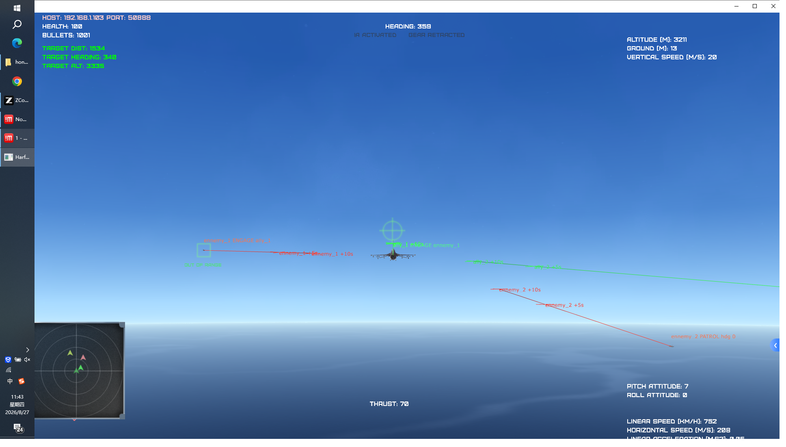
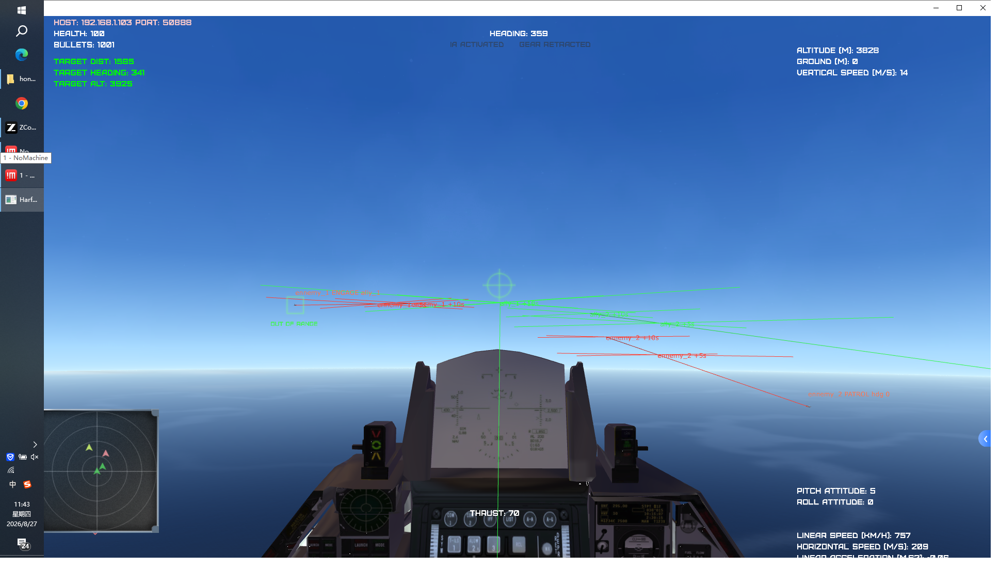
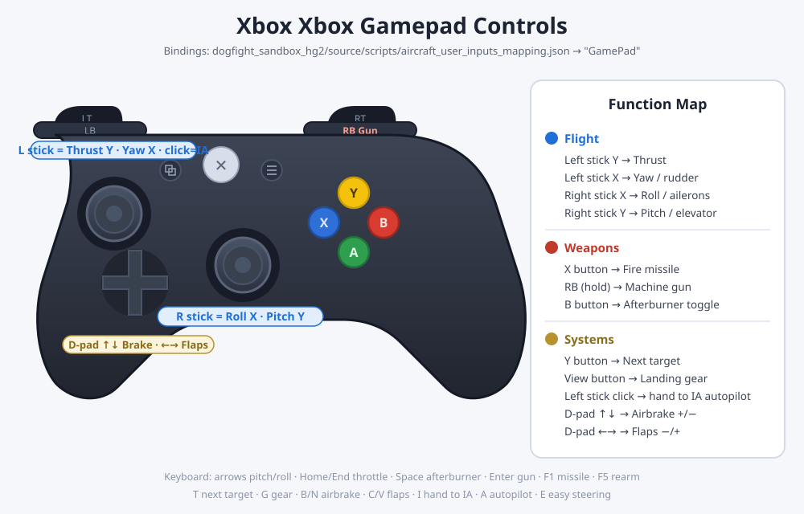

**English** | [简体中文](README.md)

# dogfightEnv

An **air-combat reinforcement learning environment** built on the [Harfang3D](https://harfang3d.com/) `dogfight_sandbox`: JSBSim 6-DOF flight dynamics + TCP/IP control protocol + LLM mission commander + in-view trajectory prediction.



## Key Features

| Feature | Description |
|---|---|
| 🛩️ **JSBSim 6-DOF physics** | F-16A aerodynamics + F100-PW-229 engine (with afterburner), realistic stall / lift-drag behavior, fixed 1/60 step for RL determinism |
| 🎮 **Human flight** | Fly directly with keyboard / Xbox-layout gamepad — [see the mapping diagram](#gamepad-controls) |
| 🌐 **TCP/IP control** | Every controller (RL client / commander / human) speaks the same JSON protocol on `IP:50888`; rendering and headless modes |
| 🤖 **LLM mission commander** | An external commander watches the whole battle and assigns `engage / patrol / retreat` tasks per aircraft; rule ↔ LLM engine switch in config |
| 📈 **Trajectory prediction** | Each aircraft's next 10 seconds of flight drawn live in the 3D view (green = friendly / red = hostile, +5s/+10s cross markers) |


## Quick Start

### 1. Start the sandbox

```bash
cd dogfight_sandbox_hg2/source
../bin/python/python.exe main.py auto_network mission=2
```

- `mission=1 / 2 / 3` selects the 1v1 / 2v2 / 3v3 network mission (default 1v1)
- Or run `dogfight_sandbox_hg2\start.bat` and pick from the menu
- Ready when the window titled `Harfang` appears; the server listens on `192.168.1.103:50888` (the machine's LAN IP)

### 2. Connect an RL environment (Gym-style)

```python
from oneVSoneEnv import oneVSoneEnv   # or twoVStwo / IA_enemy_env ...

env = oneVSoneEnv(host='192.168.1.103', port='50888', rendering=True)
obs = env.reset()
action = env.action_space.sample()    # [roll, pitch, yaw, thrust, fire]
obs, reward, done, info = env.step(action)
```

### 3. Start the LLM mission commander

In a second terminal:

```bash
cd llm_commander
../dogfight_sandbox_hg2/bin/python/python.exe commander.py
```

The commander immediately takes over every aircraft of the configured side (default: red `ennemies`): assigns attack targets, disengages badly damaged planes, patrols when no targets remain. Each aircraft's current task floats above it in the 3D view:



▲ Live 2v2 engagement: the green `ALLY_1 ENGAGE ennemy_1` and red `ENNEMY_1 ENGAGE ALLY_1` task labels in the same frame during a head-on pass

Useful flags: `--dry-run` (print decisions only), `--once` (single decision cycle), `--duration N` (stop after N seconds).

---

## Flight Dynamics: JSBSim 6-DOF

Aircraft dynamics were replaced from the sandbox's original simplified model with **JSBSim 1.2.1**:

- Every aircraft type uses the F-16 model (no open JSBSim data exists for the others; see the mapping table in `dogfight_sandbox_hg2/source/jsbsim_flight_model.py`)
- Realistic SAS: neutral stick = attitude hold; yaw input couples into roll (coordinated turns); alpha / flight-path envelope protection against stalls; predictive Auto-GCAS; automatic wings-leveling on stick release
- Missiles keep the original proportional-navigation physics
- Network protocol and action/observation spaces are fully backward compatible; `get_plane_state` adds a `physics_engine` field
- Engine switch: `dogfight_sandbox_hg2/config.json` → `"Physics": {"engine": "jsbsim"}` (set `"legacy"` to fall back)
- Fixed 1/60 FDM step; in renderless client-driven mode each `update_scene` advances exactly one step

## Trajectory Prediction

The 3D view draws each JSBSim aircraft's **next 10 seconds of predicted path** in real time: a kinematic extrapolation of the current turn rate / pitch rate / acceleration with exponential decay — green for friendlies, red for hostiles, a cross marker + `+Ns` label every 5 seconds (distance-scaled so far markers stay readable).



▲ The green prediction line and `+5s` cross marker ahead of the player's jet (HUD shows target distance/heading/lock info at left)

Config: `config.json` → `"FlightPrediction": {"enabled": true, "horizon_s": 10, "steps": 20}`

## LLM Mission Commander

`llm_commander/` is an external "air commander" process that talks to the sandbox only over IP:50888 and never drives the simulation clock — the sandbox free-runs at 60 fps, so decision latency (instant for rules, seconds for an LLM) cannot stall the battle.

**Task vocabulary** (all mapped onto existing protocol primitives):

| Task | Execution |
|---|---|
| `engage(target)` | `SET_TARGET_ID` → `ACTIVATE_IA` (target set before activation to avoid random IA targeting) |
| `patrol(heading/alt/speed)` | IA off + autopilot cruise |
| `retreat` | High-speed egress on a heading away from the nearest threat (800 m / 260 m/s) |
| `hold` | Keep current state |

**Pluggable decision engine** (`engine` field in `llm_commander/config.json`):

```jsonc
{
  "side": "ennemies",        // which side to command: ennemies / allies
  "engine": "rule",          // "rule" = built-in tactician (default, no API key)
                             // "llm"  = any OpenAI-compatible model
  "decision_period_s": 10,   // decision period; losses trigger an immediate re-plan
  "blue_ia": false,          // sparring: built-in IA on the opposite side (when commanding red)
  "red_ia": false,           // same, when commanding blue
  "llm": {
    "api_base": "https://open.bigmodel.cn/api/paas/v4/chat/completions",
    "api_key": "",           // fill in a key to enable LLM decisions
    "model": "glm-4-flash"
  }
}
```

- **Rule engine**: nearest-enemy 1v1 pairing with conflict spreading, retreat when health < 0.35 or out of missiles, focused fire when outnumbered, patrol back to center when no targets remain
- **LLM engine**: an "air commander" system prompt + battle-state JSON (grid-km positions / health / missiles / distance matrix) → strict JSON output; hallucinated plane names and invalid targets are dropped, the previous plan is kept on API failure; defaults to Zhipu GLM, switch to OpenAI / DeepSeek / local vLLM by changing `api_base`
- Decisions are logged to `llm_commander/decisions.jsonl`; commands are sent only when a task actually changes

## Camera Views

Switch views instantly on the numpad (`2/8/4/6` rear/front/left/right chase, `5` satellite, `3` cockpit, `1` cycle tracked aircraft, `Insert/PageUp` zoom):

| Rear chase (default `2`) | Front head-on (`8`) |
|:---:|:---:|
|  |  |
| **Left chase (`4`)** | **Right chase (`6`)** |
|  |  |
| **Satellite top-down (`5`)** | **Cockpit (`3`)** |
|  |  |

## Gamepad Controls

Plug in an Xbox-layout gamepad and fly (bindings: `dogfight_sandbox_hg2/source/scripts/aircraft_user_inputs_mapping.json` → `"GamePad"`):



**Keyboard**: `↑↓←→` pitch/roll · `Home/End` throttle ± · `Space` afterburner · `Enter` machine gun · `F1` missile · `F5` rearm · `T` next target · `G` gear · `B/N` airbrake · `C/V` flaps · `I` hand to IA · `A` autopilot · `E` easy steering

## RL Environments

| File | Scenario | Notes |
|---|---|---|
| `oneVSoneEnv.py` | 1v1 | Reference implementation: 25-dim obs / 5-dim action (sticks·throttle·fire), Tacview ACMI logging |
| `twoVStwo.py` | 2v2 | Two-ship coordinated actions |
| `IA_enemy_env.py` | 1v1 vs IA | Enemy flown by the built-in IA |
| `dogfightEnv.py` | Missile evasion | Dodge an incoming missile |
| `human_expert_env.py` / `controller_env.py` | Data collection | Human-expert demonstration capture |

External deps (system Python): `gym` `numpy` `harfang` `prettytable`. The sandbox itself runs on the bundled embedded Python 3.8 (`bin/python/`, jsbsim+numpy included) — zero install.

## Tests

```bash
# JSBSim physics calibration regression (14 checks: sign conventions / trim / reset / 30 s neutral stability)
cd dogfight_sandbox_hg2 && bin/python/python.exe tools/test_jsbsim_physics.py

# Commander end-to-end (12 checks: boots a 2v2 sandbox, verifies observe -> decide -> apply)
cd dogfight_sandbox_hg2 && bin/python/python.exe tools/test_llm_commander.py
```

## Repository Layout

```
dogfightEnv/
├── oneVSoneEnv.py / twoVStwo.py / ...     # Gym-style RL environments
├── llm_commander/                          # LLM mission commander
│   ├── commander.py                        #   main loop: poll -> decide -> apply -> label
│   ├── tactician.py                        #   rule engine + LLM engine + battle-state summary
│   └── config.json                         #   endpoint / side / period configuration
├── docs/images/                            # README screenshots and diagrams
└── dogfight_sandbox_hg2/                   # Harfang3D simulation sandbox
    ├── source/jsbsim_flight_model.py       #   JSBSim 6-DOF wrapper (incl. predict_path)
    ├── source/scripts/*inputs_mapping.json #   keyboard / gamepad / joystick bindings
    ├── tools/test_jsbsim_physics.py        #   physics regression (14 checks)
    ├── tools/test_llm_commander.py         #   commander end-to-end (12 checks)
    └── bin/python/                         #   embedded Python 3.8 runtime
```

## Notes

- `dogfight_sandbox_hg2/source/assets/` and `assets_compiled/` (~1.6 GB of models/textures) are not tracked; distribute them out-of-band or via [Git LFS](https://git-lfs.com/)
- The sandbox accepts a single TCP client at a time; the commander and an RL environment cannot be connected simultaneously
