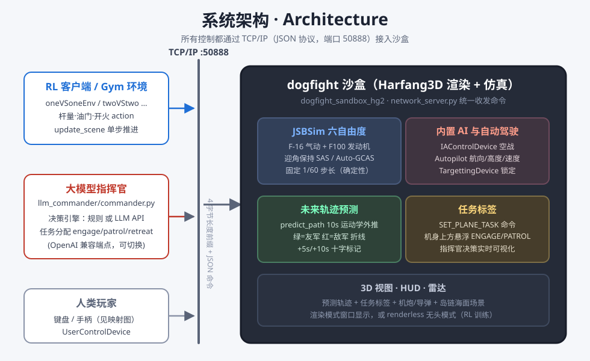
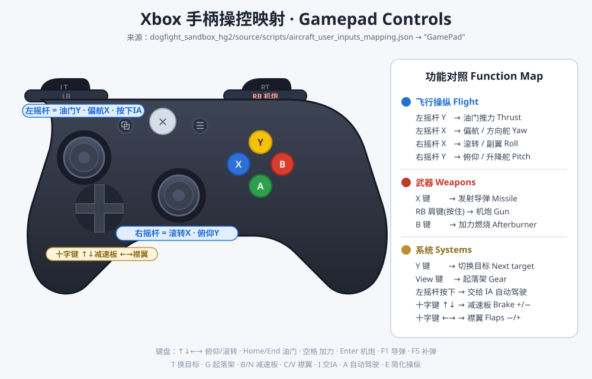

[English](README.en.md) | **简体中文**

# dogfightEnv

基于 [Harfang3D](https://harfang3d.com/) `dogfight_sandbox` 的**空战强化学习仿真环境**：JSBSim 六自由度飞行动力学 + TCP/IP 网络控制协议 + 大模型任务分配指挥官 + 画面内轨迹预测。


## 核心特性

| 特性 | 说明 |
|---|---|
| 🛩️ **JSBSim 六自由度物理** | F-16A 气动数据 + F100-PW-229 发动机（含加力），真实失速/升阻特性，固定 1/60 步长保证 RL 确定性 |
| 🎮 **真人操纵** | 键盘 / 手柄（Xbox 布局）直接飞行，[手柄映射见下图](#手柄操控映射) |
| 🌐 **TCP/IP 控制** | 所有控制（RL 客户端 / 指挥官 / 真人）统一走 `IP:50888` JSON 协议，支持渲染与无头两种模式 |
| 🤖 **大模型任务指挥官** | 外置指挥官进程观察全局战况，为每架飞机分配 `engage / patrol / retreat` 任务，决策引擎规则↔LLM 一键切换 |
| 📈 **未来轨迹预测** | 每架飞机未来 10 秒预测航线直接画在 3D 视图里（绿=友军 / 红=敌军，+5s/+10s 十字标记） |



## 快速开始

### 1. 启动沙盒

```bash
cd dogfight_sandbox_hg2/source
../bin/python/python.exe main.py auto_network mission=2
```

- `mission=1 / 2 / 3` 分别对应 1v1 / 2v2 / 3v3 网络任务（缺省 1v1）
- 也可运行 `dogfight_sandbox_hg2\start.bat` 从菜单手动选择
- 窗口标题显示 `Harfang` 即就绪，服务监听 `192.168.1.103:50888`（本机局域网 IP）

### 2. 连接 RL 环境（Gym 风格）

```python
from oneVSoneEnv import oneVSoneEnv   # 或 twoVStwo / IA_enemy_env ...

env = oneVSoneEnv(host='192.168.1.103', port='50888', rendering=True)
obs = env.reset()
action = env.action_space.sample()    # [roll, pitch, yaw, thrust, fire]
obs, reward, done, info = env.step(action)
```

### 3. 启动大模型任务指挥官

另开一个终端：

```bash
cd llm_commander
../dogfight_sandbox_hg2/bin/python/python.exe commander.py
```

指挥官立刻接管配置方（默认红方 `ennemies`）的所有飞机：分配攻击目标、残血自动脱离、无敌可打转巡逻。每架飞机的当前任务以标签形式实时悬浮在 3D 画面中：


▲ 2v2 交战实拍：绿色 `ALLY_1 ENGAGE ennemy_1` 与红色 `ENNEMY_1 ENGAGE ALLY_1` 任务标签同框，导弹拉烟正在飞向目标

常用参数：`--dry-run`（只打印不下发）、`--once`（单轮决策）、`--duration N`（N 秒后退出）。

---

## 飞行动力学：JSBSim 六自由度

飞机的力学解算已从沙盒原版简化模型替换为 **JSBSim 1.2.1**：

- 所有机型统一使用 F-16 气动模型（其余机型无开源 JSBSim 数据，映射表见 `dogfight_sandbox_hg2/source/jsbsim_flight_model.py`）
- 真实飞控（SAS）：中立杆=保持姿态；偏航杆量联动滚转（协调转弯）；迎角/航迹包线保护防失速；预测式 Auto-GCAS 防撞地；杆量回中自动改平
- 导弹仍用原版比例导引物理
- 网络协议、动作/观测空间与旧版完全兼容，`get_plane_state` 新增 `physics_engine` 字段
- 引擎切换：`dogfight_sandbox_hg2/config.json` → `"Physics": {"engine": "jsbsim"}`（改 `"legacy"` 回退原版物理）
- FDM 固定 1/60 步长；renderless 客户端驱动模式下每次 `update_scene` 精确推进一步

## 未来轨迹预测

沙盒 3D 视图为每架 JSBSim 飞机实时绘制**未来 10 秒预测航线**：基于当前转弯率 / 俯仰率 / 加速度做指数衰减的运动学外推，友军绿色、敌军红色，每 5 秒一个十字标记 + `+Ns` 标签（随距离自动缩放，远处依然可读）。


▲ 我机前方的绿色预测航线与 `+5s` 十字标记（HUD 左侧为目标距离/航向/锁定信息）

配置：`config.json` → `"FlightPrediction": {"enabled": true, "horizon_s": 10, "steps": 20}`

## 大模型任务指挥官

`llm_commander/` 是一个外置"空中指挥官"进程，与沙盒仅通过 IP:50888 通信，不接管仿真步进——沙盒自由运行 60fps，决策延迟（规则瞬时 / LLM 数秒）不影响战斗。

**任务词表**（全部映射到沙盒已有命令原语）：

| 任务 | 执行 |
|---|---|
| `engage(target)` | `SET_TARGET_ID` → `ACTIVATE_IA`（先定目标再激活，避免 IA 随机选目标） |
| `patrol(heading/alt/speed)` | 关 IA + 自动驾驶巡航 |
| `retreat` | 朝远离最近敌机航向高速脱离（低高度 800m / 高速 260m/s） |
| `hold` | 保持现状 |

**决策引擎可插拔**（`llm_commander/config.json` 的 `engine` 字段）：

```jsonc
{
  "side": "ennemies",        // 指挥哪一方：ennemies / allies
  "engine": "rule",          // "rule" = 内置规则引擎（默认，无需 API key）
                             // "llm"  = OpenAI 兼容大模型
  "decision_period_s": 10,   // 决策周期；战损事件触发立即重判
  "blue_ia": false,          // 演示时给对方开内置 IA 陪练（指挥红方时）
  "red_ia": false,           // 同上（指挥蓝方时）
  "llm": {
    "api_base": "https://open.bigmodel.cn/api/paas/v4/chat/completions",
    "api_key": "",           // 填入 key 即启用 LLM 决策
    "model": "glm-4-flash"
  }
}
```

- **规则引擎**：最近敌 1v1 配对（目标去冲突分散火力）、血量 < 0.35 或弹尽自动脱离、劣势集中火力、无敌可打转巡逻回中心
- **LLM 引擎**：中文"空中指挥官"system prompt + 战况 JSON（位置网格化 km / 血量 / 余弹 / 距离矩阵）→ 严格 JSON 输出；幻觉机名/非法目标自动丢弃，API 失败沿用上轮方案；默认对接智谱，改 `api_base` 可切 OpenAI / DeepSeek / 本地 vLLM 等
- 决策记录写入 `llm_commander/decisions.jsonl`；任务变化才下发，不刷命令

## 多视角观看

小键盘即时切换观察视角（`2/8/4/6` 尾后/前方/左侧/右侧跟拍，`5` 卫星俯视，`3` 座舱，`1` 切换跟拍目标，`Insert/PageUp` 调整视野）：

| 尾后跟拍（默认 `2`） | 前方迎头（`8`） |
|:---:|:---:|
|  |  |
| **左侧跟拍（`4`）** | **右侧跟拍（`6`）** |
|  |  |
| **卫星俯视（`5`）** | **座舱视角（`3`）** |
|  |  |

## 手柄操控映射

接入 Xbox 布局手柄即可直接飞行（映射定义：`dogfight_sandbox_hg2/source/scripts/aircraft_user_inputs_mapping.json` → `"GamePad"`）：



**键盘映射**：`↑↓←→` 俯仰/滚转 · `Home/End` 油门 ± · `空格` 加力 · `Enter` 机炮 · `F1` 导弹 · `F5` 补弹 · `T` 换目标 · `G` 起落架 · `B/N` 减速板 · `C/V` 襟翼 · `I` 交 IA · `A` 自动驾驶 · `E` 简化操纵

## RL 环境一览

| 文件 | 场景 | 说明 |
|---|---|---|
| `oneVSoneEnv.py` | 1v1 | 参考实现：25 维观测 / 5 维动作（杆量·油门·开火），Tacview ACMI 记录 |
| `twoVStwo.py` | 2v2 | 双机协同动作 |
| `IA_enemy_env.py` | 1v1 vs IA | 敌机由内置 IA 驾驶 |
| `dogfightEnv.py` | 反导规避 | 躲避来袭导弹 |
| `human_expert_env.py` / `controller_env.py` | 数据采集 | 人类专家演示录采集 |

外部依赖（系统 Python）：`gym` `numpy` `harfang` `prettytable`；沙盒本身用自带嵌入式 Python 3.8（`bin/python/`，含 jsbsim+numpy），开箱即用。

## 测试

```bash
# JSBSim 物理校准回归（14 项：符号约定/配平/复位/30s 中立稳定性）
cd dogfight_sandbox_hg2 && bin/python/python.exe tools/test_jsbsim_physics.py

# 指挥官端到端（12 项：自动起 2v2 沙盒，验证 观察→决策→下发 全链路）
cd dogfight_sandbox_hg2 && bin/python/python.exe tools/test_llm_commander.py
```

## 目录结构

```
dogfightEnv/
├── oneVSoneEnv.py / twoVStwo.py / ...     # Gym 风格 RL 环境
├── llm_commander/                          # 大模型任务指挥官
│   ├── commander.py                        #   主循环：轮询→决策→下发→标签
│   ├── tactician.py                        #   规则引擎 + LLM 引擎 + 战况汇总
│   └── config.json                         #   端点/阵营/周期配置
├── docs/images/                            # README 图片与示意图
└── dogfight_sandbox_hg2/                   # Harfang3D 仿真沙盒
    ├── source/jsbsim_flight_model.py       #   JSBSim 六自由度封装（含 predict_path）
    ├── source/scripts/*inputs_mapping.json #   键盘/手柄/摇杆映射
    ├── tools/test_jsbsim_physics.py        #   物理回归（14 项）
    ├── tools/test_llm_commander.py         #   指挥官端到端（12 项）
    └── bin/python/                         #   嵌入式 Python 3.8 运行时
```

## 注意

- `dogfight_sandbox_hg2/source/assets/` 与 `assets_compiled/`（约 1.6 GB 模型/贴图）未纳入版本管理，如需完整资源请通过网盘分发或使用 [Git LFS](https://git-lfs.com/)
- 沙盒一次接受一个 TCP 客户端连接；指挥官与 RL 环境不能同时接入
