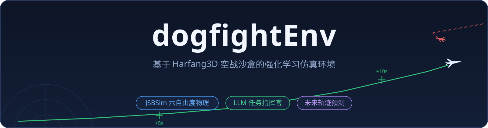

<a id="top"></a>

<div align="center">



<br/>

[](https://github.com/SergioTermann/dogfightEnv/stargazers)
[](https://github.com/SergioTermann/dogfightEnv/network/members)
[](https://github.com/SergioTermann/dogfightEnv/issues)
[](dogfight_sandbox_hg2/LICENSE)
[](#-快速开始)
[](#-rl-训练套件)
[](#-快速开始)

<br/>

<a href="#-快速开始"></a>
<a href="https://github.com/SergioTermann/dogfightEnv/blob/main/dogfight_sandbox_hg2/documentation_network.md"></a>
<a href="#-rl-训练套件"></a>
<a href="https://github.com/SergioTermann/dogfightEnv/issues/new"></a>

**[English](README.en.md) | 简体中文**

✨ [核心特性](#-核心特性) · 🏗️ [系统架构](#-系统架构) · 🚀 [快速开始](#-快速开始) · 🛩️ [JSBSim 仿真](#-jsbsim-六自由度飞行仿真) · 🔮 [轨迹预测](#-未来轨迹预测) · 🎖️ [LLM 指挥官](#-大模型任务指挥官) · 🎓 [RL 训练](#-rl-训练套件) · 🕹️ [操控](#-操控) · 📷 [视角](#-多视角观察) · 🧪 [测试](#-测试) · 🗺️ [路线](#-开发路线) · 📄 [许可证](#-许可证)

</div>

---

## ✨ 核心特性

| | 特性 | 说明 |
|:---:|---|---|
| 🛩️ | **JSBSim 六自由度物理** | F-16A 气动数据 + F100-PW-229 发动机（含加力），真实失速与升阻特性；固定 1/60 步长，RL 训练完全确定 |
| 🎖️ | **大模型任务指挥官** | 外置指挥官进程观察全局战况，为每架飞机分配 `engage / patrol / retreat` 任务；规则引擎 ↔ LLM 一键切换 |
| 📈 | **未来轨迹预测** | 每架飞机未来 10 秒航线实时画进 3D 视图（绿=友军 / 红=敌军，+5s / +10s 十字标记） |
| 🌐 | **统一 TCP/IP 协议** | RL 客户端、指挥官、真人玩家共用 `IP:50888` JSON 协议，渲染 / 无头双模式（[完整协议文档](https://github.com/SergioTermann/dogfightEnv/blob/main/dogfight_sandbox_hg2/documentation_network.md)） |
| 🎮 | **人机同屏** | 键盘 / Xbox 手柄直接飞行，八种镜头即时切换，可作为专家给 RL 录制演示数据 |
| 🧪 | **自带测试** | 14 项物理回归 + 12 项指挥官端到端 + 10 项训练冒烟，改代码有护栏 |

## 🏗️ 系统架构

所有控制端（RL 客户端 / 大模型指挥官 / 人类玩家）都通过同一条 TCP/IP 通道接入沙盒：


## 🚀 快速开始

| 项目 | 要求 |
|---|---|
| 操作系统 | Windows 10 / 11 |
| 沙盒运行时 | 自带嵌入式 Python 3.8（`bin/python/`，含 jsbsim + numpy），开箱即用 |
| RL 环境（系统 Python） | `gym` · `numpy` · `harfang` · `prettytable` |
| 训练套件 | `torch ≥ 2.0`：`pip install -r requirements-train.txt` |
| GPU | 可选，CUDA 加速训练 |

**1️⃣ 启动沙盒**

```bash
cd dogfight_sandbox_hg2/source
../bin/python/python.exe main.py auto_network mission=1
```

- `mission=1 / 2 / 3` 对应 1v1 / 2v2 / 3v3 网络任务（缺省 1v1）；也可运行 `dogfight_sandbox_hg2\start.bat` 从菜单选择
- 窗口标题显示 `Harfang` 即就绪；服务监听本机局域网 IP 的 `50888` 端口（窗口左上角会显示 `HOST / PORT`）

**2️⃣ 接入 Gym 风格 RL 环境**

```python
from oneVSoneEnv import oneVSoneEnv   # 或 twoVStwo / IA_enemy_env ...

env = oneVSoneEnv(host='192.168.1.103', port='50888', rendering=True)   # host 换成你的局域网 IP
obs = env.reset()
action = env.action_space.sample()    # [roll, pitch, yaw, thrust, fire]
obs, reward, done, info = env.step(action)
```

**3️⃣ 启动大模型任务指挥官**（另开一个终端）

```bash
cd llm_commander
../dogfight_sandbox_hg2/bin/python/python.exe commander.py
```

指挥官立刻接管配置方（默认红方 `ennemies`）的所有飞机：分配攻击目标、残血自动脱离、无敌可打转巡逻，任务标签实时悬浮在 3D 画面中：

| 指挥官任务分配实拍（2v2） | 未来轨迹预测 |
|:---:|:---:|
|  |  |
| ▲ 绿色 `ALLY_1 ENGAGE ennemy_1` 与红色 `ENNEMY_1 ENGAGE ALLY_1` 任务标签同框 | ▲ 我机前方绿色预测航线与 `+5s` 十字标记 |

常用参数：`--dry-run`（只打印不下发）、`--once`（单轮决策）、`--duration N`（N 秒后退出）。

> 💡 训练 / 回放智能体见 [RL 训练套件](#-rl-训练套件)。

## 🛩️ JSBSim 六自由度飞行仿真

飞机力学解算已从沙盒原版简化模型替换为 **JSBSim 1.2.1**：

- 所有机型统一使用 F-16 气动模型（其余机型无开源 JSBSim 数据，映射表见 `dogfight_sandbox_hg2/source/jsbsim_flight_model.py`）
- 真实飞控（SAS）：中立杆=保持姿态；偏航杆量联动滚转（协调转弯）；迎角/航迹包线保护防失速；预测式 Auto-GCAS 防撞地；杆量回中自动改平
- 导弹仍用原版比例导引物理
- 网络协议、动作/观测空间与旧版完全兼容，`get_plane_state` 新增 `physics_engine` 字段
- FDM 固定 1/60 步长；renderless 客户端驱动模式下每次 `update_scene` 精确推进一步
- 引擎切换：`dogfight_sandbox_hg2/config.json` → `"Physics": {"engine": "jsbsim"}`（改 `"legacy"` 回退原版物理）

## 🔮 未来轨迹预测

3D 视图为每架 JSBSim 飞机实时绘制**未来 10 秒预测航线**：基于当前转弯率 / 俯仰率 / 加速度做指数衰减的运动学外推，友军绿色、敌军红色，每 5 秒一个十字标记 + `+Ns` 标签（随距离自动缩放，远处依然可读）。

配置：`config.json` → `"FlightPrediction": {"enabled": true, "horizon_s": 10, "steps": 20}`

## 🎖️ 大模型任务指挥官

`llm_commander/` 是一个外置「空中指挥官」进程，与沙盒仅通过 IP:50888 通信，**不接管仿真步进**——沙盒自由运行 60fps，决策延迟（规则瞬时 / LLM 数秒）不影响战斗。

**任务词表**（全部映射到沙盒已有命令原语）：

| 任务 | 执行 |
|---|---|
| `engage(target)` | `SET_TARGET_ID` → `ACTIVATE_IA`（先定目标再激活，避免 IA 随机选目标） |
| `patrol(heading/alt/speed)` | 关 IA + 自动驾驶巡航 |
| `retreat` | 朝远离最近敌机航向高速脱离（低高度 800m / 高速 260m/s） |
| `hold` | 保持现状 |

**决策引擎可插拔**（`llm_commander/config.json` 的 `engine` 字段）：

```jsonc
{
  "side": "ennemies",        // 指挥哪一方：ennemies / allies
  "engine": "rule",          // "rule" = 内置规则引擎（默认，无需 API key）
                             // "llm"  = OpenAI 兼容大模型
  "decision_period_s": 10,   // 决策周期；战损事件触发立即重判
  "blue_ia": false,          // 演示时给对方开内置 IA 陪练（指挥红方时）
  "red_ia": false,           // 同上（指挥蓝方时）
  "llm": {
    "api_base": "https://open.bigmodel.cn/api/paas/v4/chat/completions",
    "api_key": "",           // 填入 key 即启用 LLM 决策
    "model": "glm-4-flash"
  }
}
```

- **规则引擎**：最近敌 1v1 配对（目标去冲突分散火力）、血量 < 0.35 或弹尽自动脱离、劣势集中火力、无敌可打转巡逻回中心
- **LLM 引擎**：中文「空中指挥官」system prompt + 战况 JSON（位置网格化 km / 血量 / 余弹 / 距离矩阵）→ 严格 JSON 输出；幻觉机名/非法目标自动丢弃，API 失败沿用上轮方案；默认对接智谱，改 `api_base` 可切 OpenAI / DeepSeek / 本地 vLLM 等
- 决策记录写入 `llm_commander/decisions.jsonl`；任务变化才下发，不刷命令

## 🎓 RL 训练套件

`training/` 提供自研模块化算法套件（纯 PyTorch，零新增依赖）+ 统一训练入口：

| 算法 | 类型 | 动作空间 | 关键组件 |
|---|---|:---:|---|
| `ppo` | 在策略 | 连续 Box | GAE、clip 目标、高斯策略 |
| `sac` | 离策略 | 连续 Box | 双 Q、温度自动调、软更新 |
| `rainbow` | 离策略 | 离散网格（默认 54 档） | n-step、双 Q、决斗、NoisyNet、PER、C51 |

```bash
# 1. 启动沙盒（1v1）
cd dogfight_sandbox_hg2/source && ../bin/python/python.exe main.py auto_network

# 2. 训练（另开终端，系统 Python）
python -m training.train --algo ppo --env oneVSone --timesteps 500000
python -m training.enjoy --model checkpoints/ppo_oneVSone/model_best.pt   # 加载 checkpoint 观看
```

<details>
<summary>⚙️ 更多训练选项与说明</summary>

```bash
python -m training.train --algo sac     --env oneVSone --timesteps 1000000
python -m training.train --algo rainbow --env oneVSone --timesteps 1000000
```

- `--set key=value` 覆盖任意超参（如 `--set lr=1e-4 gamma=0.995`）；`--device cpu/cuda`、`--render`、`--seed`、`--no-normalize` 可选
- 环境适配层自动处理旧版 gym API、观测归一化（运行均值方差随 checkpoint 保存）、reset 陈旧观测修补；Rainbow 通过 `DiscreteActionEnv` 把连续动作离散成网格（roll/pitch/thrust/fire 组合，`training/wrapper.py` 可改）
- 日志写入 `checkpoints/<algo>_<env>/log.jsonl`（episode 回报/长度/损失），最优模型存 `model_best.pt`
- 沙盒单连接限制：一次只能跑一个训练进程
- 无沙盒自测：`python -m training.tests.test_algos_toy`（MockEnv 三算法收敛 + 存取）

</details>

**内置 Gym 环境**：

| 文件 | 场景 | 说明 |
|---|---|---|
| `oneVSoneEnv.py` | 1v1 | 参考实现：25 维观测 / 5 维动作（杆量·油门·开火），Tacview ACMI 记录 |
| `twoVStwo.py` | 2v2 | 双机协同动作 |
| `IA_enemy_env.py` | 1v1 vs IA | 敌机由内置 IA 驾驶 |
| `dogfightEnv.py` | 反导规避 | 躲避来袭导弹 |
| `human_expert_env.py` / `controller_env.py` | 数据采集 | 人类专家演示录制 |

## 🕹️ 操控

**键盘**：`↑↓←→` 俯仰/滚转 · `Home/End` 油门 ± · `空格` 加力 · `Enter` 机炮 · `F1` 导弹 · `F5` 补弹 · `T` 换目标 · `G` 起落架 · `B/N` 减速板 · `C/V` 襟翼 · `I` 交 IA · `A` 自动驾驶 · `E` 简化操纵

<details>
<summary>🎮 Xbox 手柄映射（点击展开）</summary>

接入 Xbox 布局手柄即可直接飞行（映射定义：`dogfight_sandbox_hg2/source/scripts/aircraft_user_inputs_mapping.json` → `"GamePad"`）：


</details>

## 📷 多视角观察

小键盘即时切换观察视角：`2/8/4/6` 尾后/前方/左侧/右侧跟拍 · `5` 卫星俯视 · `3` 座舱 · `1` 切换跟拍目标 · `Insert/PageUp` 调整视野。

<details>
<summary>🖼️ 六种视角画廊（点击展开）</summary>

| 尾后跟拍（默认 `2`） | 前方迎头（`8`） |
|:---:|:---:|
|  |  |
| **左侧跟拍（`4`）** | **右侧跟拍（`6`）** |
|  |  |
| **卫星俯视（`5`）** | **座舱视角（`3`）** |
|  |  |

</details>

## 🧪 测试

```bash
# JSBSim 物理校准回归（14 项：符号约定/配平/复位/30s 中立稳定性）
cd dogfight_sandbox_hg2 && bin/python/python.exe tools/test_jsbsim_physics.py

# 指挥官端到端（12 项：自动起 2v2 沙盒，验证 观察→决策→下发 全链路）
cd dogfight_sandbox_hg2 && bin/python/python.exe tools/test_llm_commander.py

# 训练套件真沙盒冒烟（10 项）
python dogfight_sandbox_hg2/tools/test_training_smoke.py
```

## ⚠️ 已知限制

- 沙盒一次只接受**一个** TCP 客户端连接：指挥官与 RL 环境不能同时接入
- 所有机型共用 F-16 气动模型（其余机型暂无开源 JSBSim 数据）
- `dogfight_sandbox_hg2/source/assets/` 与 `assets_compiled/`（约 1.6 GB 模型/贴图）未纳入版本管理，需网盘分发或 [Git LFS](https://git-lfs.com/)

## 🗺️ 开发路线

- [ ] 沙盒资产经 Git LFS 分发，克隆即完整
- [ ] 多客户端并发（指挥官与 RL 环境同时在线）
- [ ] 更多机型的 JSBSim 气动数据

有想法？欢迎 [提 Issue](https://github.com/SergioTermann/dogfightEnv/issues/new)。

## 🤝 参与贡献

欢迎 Issue 与 PR！流程：Fork → 建分支 → 改动后跑通 [测试](#-测试) → 提 PR。

<a href="https://github.com/SergioTermann/dogfightEnv/issues/new"></a>
<a href="https://github.com/SergioTermann/dogfightEnv/issues/new"></a>
<a href="https://github.com/SergioTermann/dogfightEnv/compare"></a>
<a href="https://github.com/SergioTermann/dogfightEnv/fork"></a>

## 🙏 致谢

- **[harfang3d/dogfight-sandbox-hg2](https://github.com/harfang3d/dogfight-sandbox-hg2)** —— 本项目的基础。沙盒的 Harfang3D 渲染与仿真框架、飞机/导弹/舰船模型、岛链海面场景以及 TCP/IP 网络协议全部来自该原版项目，在此基础上完成了 JSBSim 六自由度物理替换、飞控 SAS、轨迹预测与 LLM 任务指挥官等扩展。感谢 Harfang Technologies 的开源贡献。
- **[mrwangyou/DBRL](https://github.com/mrwangyou/DBRL)** —— 感谢 DBRL 对本项目的大力支持。

## 📄 许可证

本仓库包含的 [dogfight_sandbox_hg2](dogfight_sandbox_hg2/) 沙盒源自 [harfang3d/dogfight-sandbox-hg2](https://github.com/harfang3d/dogfight-sandbox-hg2)，遵循 **GPL-3.0** 授权（见 [dogfight_sandbox_hg2/LICENSE](dogfight_sandbox_hg2/LICENSE)）；对沙盒的修改与扩展同样按 GPL-3.0 提供。

---

<div align="center">

**如果这个项目对你有帮助，欢迎点一个 ⭐**

<a href="https://github.com/SergioTermann/dogfightEnv"></a>

<br/>

Powered by [Harfang3D](https://harfang3d.com/) · [JSBSim](https://github.com/JSBSim-Team/jsbsim) · [PyTorch](https://pytorch.org/)


[⬆ 回到顶部](#top)

</div>
